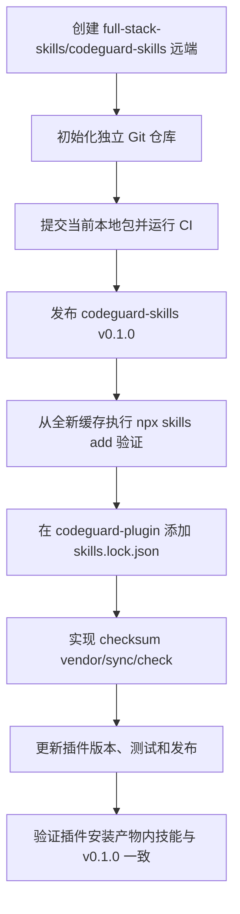

# 从 codeguard-plugin 拆分为 codeguard-skills

## 已完成

- 建立本地独立包目录和 68 项 manifest。
- 从 Codeguard 运行时注册表提取 57 个语言/文件类型能力快照。
- 将 53 个 stable 与 4 个 planned 状态写入技能，不再沿用旧文档中的过期状态。
- 为语言技能补齐边界、安全、Workflow、失败语义、gotchas、FAQ、references 与 examples。
- 深化 11 个核心技能，并清理跨 sibling 的相对链接。
- 建立确定性生成器、包级 lint 和 TRACE 前后对比。

## 为什么暂时没有修改 codeguard-plugin

当前 `https://github.com/full-stack-skills/codeguard-skills.git` 不存在。若先删除插件内技能或写入一个不存在的 vendor 来源，会让已发布插件失去技能或形成不可复现的供应链引用。

此外，`codeguard-plugin` 的仓库规则要求改动与版本、发布链一起处理。本次没有得到创建远端、发布版本、修改插件发行物或推送的授权，因此插件工作树保持不变。

## 首次发布顺序



## 插件 vendor 契约建议

锁文件至少应包含：

```json
{
  "package": "full-stack-skills/codeguard-skills",
  "version": "0.1.0",
  "commit": "<immutable-commit-sha>",
  "sha256": "<archive-or-tree-checksum>",
  "destination": "skills"
}
```

同步工具应支持：

- `check`：只读比较版本、文件清单和 checksum；
- `sync`：从固定 commit/tag 获取并原子替换 vendor 快照；
- `--offline`：使用已校验缓存；
- 明确拒绝未提交的插件技能本地修改，避免覆盖用户工作；
- CI 同时检查技能包版本、vendor checksum 和插件 manifest。

## 完成定义

只有以下证据都存在时，才能说“已独立并完成迁移”：

1. 远端仓库和不可变 tag 存在；
2. 技能包 CI 通过；
3. 从全新缓存可安装 68 个技能；
4. 插件通过 lock/checksum vendor 消费该版本；
5. 插件构建、安装产物和宿主运行时验证通过；
6. 旧的手工双写路径被移除或明确标为生成物。
