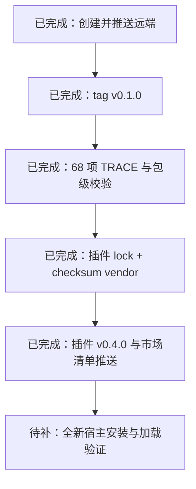

# 从 codeguard-plugin 拆分为 codeguard-skills

## 已完成

- 创建公开远端 `full-stack-skills/codeguard-skills` 并推送 `main`。
- 建立本地独立包目录和 68 项 manifest。
- 从 Codeguard 运行时注册表提取 57 个语言/文件类型能力快照。
- 将 53 个 stable 与 4 个 planned 状态写入技能，不再沿用旧文档中的过期状态。
- 为语言技能补齐边界、安全、Workflow、失败语义、gotchas、FAQ、references 与 examples。
- 深化 11 个核心技能，并清理跨 sibling 的相对链接。
- 建立确定性生成器、包级 lint 和 TRACE 前后对比。
- 创建并推送不可变 tag `v0.1.0`，解析 commit 为 `d6f2ee3c7b67ef037082212ca13a4bda758eefe0`。
- 在 `codeguard-plugin` v0.4.0 建立 `skills.lock.json`、逐技能 SHA-256、离线/在线 vendor check、同步工作流与变异测试。
- 插件只替换 lock 中列出的 68 个外部技能；未列入 lock 的插件内部定制技能会被保留。
- 推送 `codeguard-plugin` v0.4.0 源码提交与 PartMe 插件市场 0.4.0 清单。

## 当前职责边界

- `codeguard-skills` 是 68 个跨宿主技能的唯一事实源。
- `codeguard-plugin/skills` 中 lock 列出的目录是离线 vendor 生成物，不允许手工修改。
- 插件内部定制技能必须不列入 lock，由插件仓直接维护。
- CLI、hooks、linters、commands、MCP 与运行时编排继续属于插件仓。

## 发布顺序与证据



## 已实现的插件 vendor 契约

锁文件包含：

```json
{
  "package": "codeguard-skills",
  "repo": "https://github.com/full-stack-skills/codeguard-skills.git",
  "ref": "v0.1.0",
  "sha": "d6f2ee3c7b67ef037082212ca13a4bda758eefe0",
  "skills": ["codeguard", "... 共 68 项"],
  "dest": "skills/",
  "sha256": {"codeguard": "<per-skill-digest>"}
}
```

同步工具已经支持：

- `update`：从固定 tag 获取受管技能，并刷新解析 commit 与逐技能摘要；
- `check --offline`：不访问网络，验证插件树与 lock 摘要；
- `check`：同时验证远端 ref 未漂移、上游内容与 lock 一致；
- 只替换受管技能，保留未列入 lock 的插件内部定制技能；
- CI 执行在线/离线校验、变异测试，并阻止绕过 lock 的受管技能编辑。

## 完成定义

只有以下证据都存在时，才能说“已独立并完成迁移”：

1. ✅ 远端仓库和不可变 tag 存在；
2. ✅ 技能包校验与 TRACE 评估通过；
3. ⏳ 从全新缓存或真实宿主安装并加载 68 个技能；
4. ✅ 插件通过 lock/checksum vendor 消费该版本；
5. ⏳ 插件安装产物和真实宿主运行时加载验证；
6. ✅ 旧的手工双写路径已改为受管生成物，插件内部定制边界已明确。
