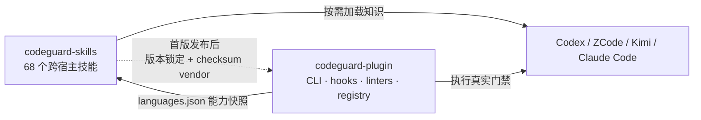

<div align="center">

# codeguard-skills

**面向 Codex、ZCode、Kimi 与其他 Agent Skills 客户端的 Codeguard 质量门禁知识包**

简体中文 | [English](./README.md)

</div>

## 当前状态

该仓库是从 `codeguard-plugin/skills` 拆出的独立技能包，包含 **68 个技能**：11 个核心治理技能与 57 个语言/文件类型技能。当前已完成包结构、技能深化、生成器、lint、TRACE 评估与 GitHub `main` 分支首次推送。

远端仓库：[full-stack-skills/codeguard-skills](https://github.com/full-stack-skills/codeguard-skills)。当前尚未创建 release/tag，也尚未把该包以版本锁定方式回接到 `codeguard-plugin`；不应把 `main` 分支推送与 Marketplace/插件发布混为一谈。

独立包负责可跨宿主复用的操作知识；`codeguard-plugin` 继续负责 CLI、hooks、linters 和运行时编排。待远端仓库建立和首版发布后，插件应通过带版本与校验值的 vendor 锁文件消费技能快照，避免两份手工维护的技能再次漂移。

## 为什么要独立

旧结构把技能文档与 Claude/Codex 插件运行时代码放在同一仓库，造成三个问题：

1. 只能安装插件技能，难以给 ZCode、Kimi 等通用 Agent Skills 客户端独立安装；
2. 技能描述与运行时 `languages.json` 漂移，部分已经 stable 的语言仍被写成 planned；
3. 34–39 行的语言技能缺少边界、失败语义、工具缺失降级、复验和场景示例。

拆分后的职责关系：



## 技能分层

| 层 | 数量 | 内容 |
|---|---:|---|
| 总入口与命令 | 6 | `codeguard`、`detect`、`check`、`fix`、`cve`、`init` |
| Git 治理 | 2 | `codeguard-git-branch`、`codeguard-git-commit` |
| 安全治理 | 3 | `codeguard-security-code`、`codeguard-security-api`、`codeguard-security-data` |
| 语言/文件类型 | 57 | 53 个 stable 门禁 + 4 个 planned 能力说明 |

语言技能统一包含：触发条件、适用/不适用边界、隐私与安全、能力快照、七步 Workflow、失败分类、输出模板、至少六个 gotchas、FAQ、两类 references 和四个 examples。

## 安装形状

可以把技能目录复制或链接到宿主支持的技能目录。通用 Skills CLI 的预期安装形状为：

```bash
npx skills add full-stack-skills/codeguard-skills
npx skills add full-stack-skills/codeguard-skills --skill codeguard-check
```

安装命令是宿主侧契约；插件发布、Marketplace 安装和真实宿主加载仍需独立验证。

## 开发与验证

```bash
# 检查 68 个技能的 frontmatter 和命名
python3 scripts/lint_skills.py

# 检查语言注册表生成物是否同步
python3 scripts/generate_language_skills.py --check --format json

# 检查核心技能 references/examples 是否同步
python3 scripts/generate_core_resources.py --check --format json
```

`generate_language_skills.py` 默认只检查，只有显式传入 `--write` 才写入。它以 `references/languages.json` 为能力快照，不删除未知文件。`generate_core_resources.py` 也遵循相同的 check/write 模式。

TRACE 评估结果见 [TRACE_EVALUATION.md](./TRACE_EVALUATION.md)。拆分与发布剩余步骤见 [MIGRATION.md](./MIGRATION.md)。

## 目录

```text
codeguard-skills/
├── .claude-plugin/plugin.json
├── skills/                         # 68 个独立 Agent Skills
├── references/languages.json       # 来自 Codeguard 运行时的能力快照
├── scripts/
│   ├── generate_language_skills.py
│   ├── generate_core_resources.py
│   └── lint_skills.py
├── MIGRATION.md
├── TRACE_EVALUATION.md
├── README.md
└── README.zh-CN.md
```

## 维护规则

- `SKILL.md` 必须少于 500 行；长材料放入本技能自己的 `references/`。
- description 必须单行并描述“什么时候触发”，不能使用 YAML block scalar。
- 技能之间只通过技能名与安装命令交接，不能链接 `../sibling-skill/`。
- `stable`、`planned` 与具体命令必须从运行时注册表同步，不能凭记忆更新。
- 工具缺失、配置缺失、超时与 planned 均不能写成 PASS。
- 技能包不包含 Codeguard CLI；文档示例不能冒充运行时可执行证据。

## 许可证

Apache License 2.0，见 [LICENSE](./LICENSE)。
